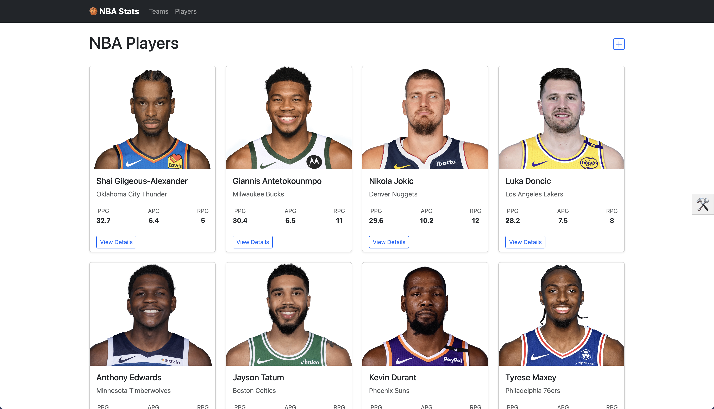
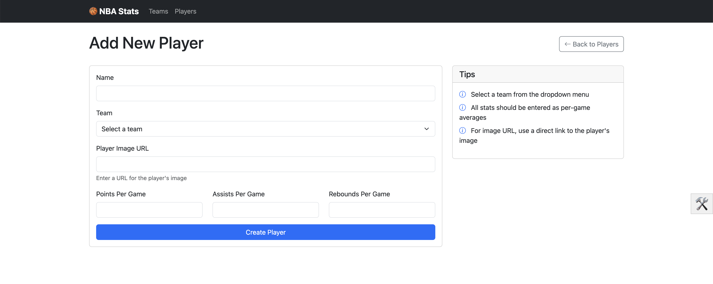
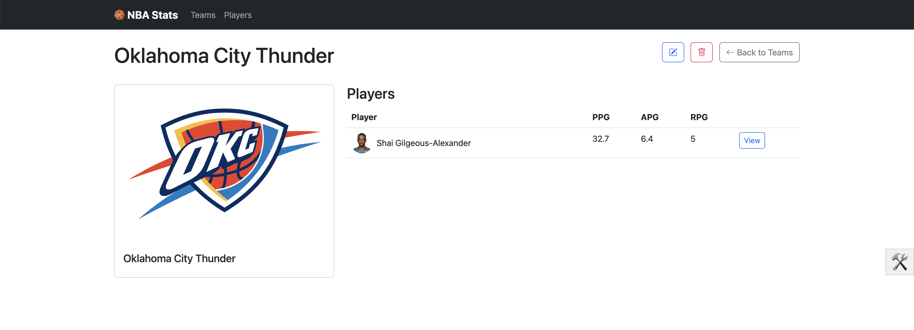
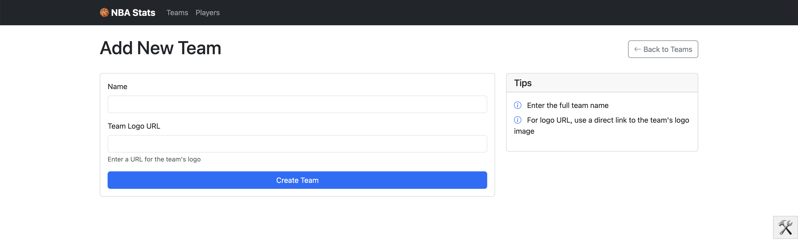
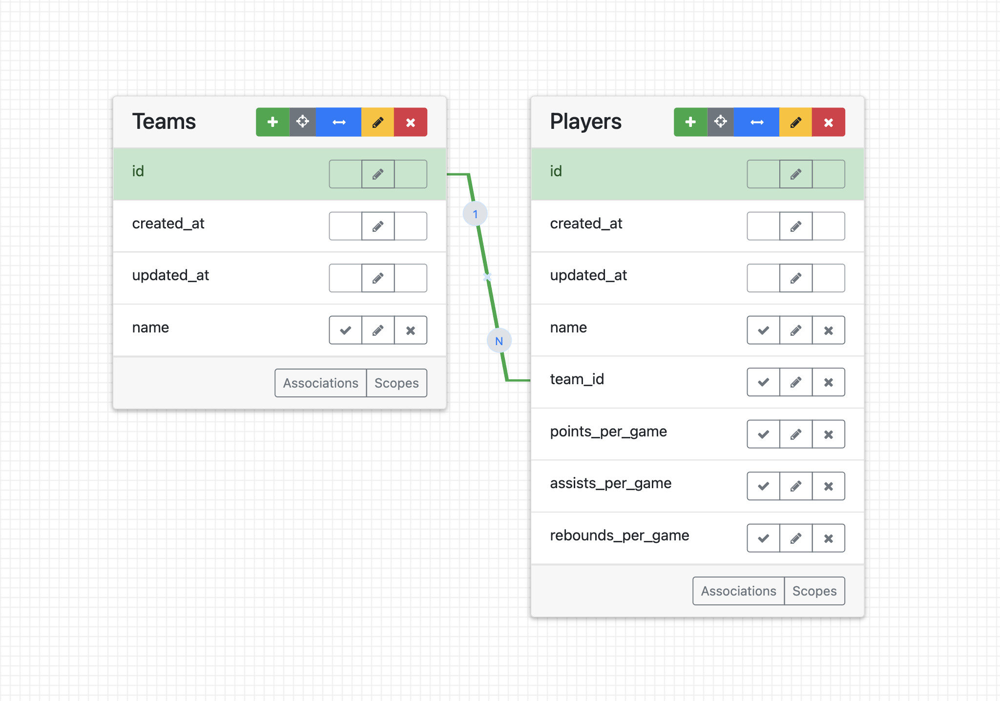

# NBA stats project

## Description
Track real-time stats and deep insights on NBA players and teams—all in one powerful app.

## Table of Contents

- [Getting Started](#getting-started)
  - [Prerequisites](#prerequisites)
  - [Installation](#installation)
  - [Usage](#usage)
- [Contributing](#contributing)
- [API Documentation](#api-documentation)
- [Troubleshooting](#troubleshooting)
- [Contact](#contact)
- [License](#license)

## Getting Started

### Prerequisites

- Ensure you have Rails 7.0.8 installed.
- Ensure you have Ruby 3.2.1 installed.
- Ensure you have PostgreSQL 14.9 installed.
- Ensure you have Bundler 2.4.6 installed.

### Installation

To get nba-stats-project up and running on your local machine, follow these steps:

1. Clone the repository to your local machine:
```bash
git clone https://github.com/Ritumka/nba-stats-project
```
2. Navigate to the application directory:
```bash
cd nba-stats-project
```
3. Install the required Ruby gems by running Bundler (make sure you have Bundler installed):
```bash
bundle install
```
4. Configure ENV. See details in [Configuration](#configuration).

5. Since this application uses PostgreSQL, ensure you have PostgreSQL installed and running on your machine. Then create and migrate the database:
```bash
rails db:create db:migrate
```
6. To populate the database with initial data, run the sample data task (Weight Class 155 has the most users. Use this to test any features):
```bash
bin/rails slurp:players_teams
```

### Usage

1. Start the Rails server:
```bash
rails server
```
2. Visit http://localhost:3000 in your web browser to view the application.
Follow the on-screen instructions to use the application.


## Contributing

Contributions are welcome! Please follow these guidelines:

1. Fork the repository
2. Create a new branch 
```bash
git checkout -b feature-branch
```
3. Commit your changes
```bash
git commit -m 'Add some feature'
```
4. Push to the branch
```bash
git push origin feature-branch
```
5. Open a pull request

Before contributing, please read through the existing issues and pull requests to ensure that someone else isn't already working on similar changes.

### API Documentation: 

No API endpoints provided.

## Troubleshooting

If you encounter any issues, please review the following common problems and solutions. If your issue isn't listed here, feel free to open an issue in the repository.

1. **Problem: `bundle install` fails**
   **Solution:**
   - Ensure that you have Ruby and Bundler installed.
   - Check your Ruby version by running `ruby -v`. If you need to install a specific Ruby version, use `rbenv` or `rvm`.
   - Run `gem install bundler` to install or update Bundler.
   - If the error mentions missing gems, try running `bundle update` to resolve conflicts.

2. **Problem: Database Setup Issues**
   **Solution:**
   - Make sure your database server (e.g., PostgreSQL, MySQL) is running.
   - Ensure that your `config/database.yml` is configured correctly for your environment.
   - If you encounter errors during `rails db:create` or `rails db:migrate`, try running `rails db:reset` to recreate the database from scratch.

3. **Problem: Assets Not Loading (CSS, JS, Images)**
   **Solution:**
   - Run `rails assets:precompile` to compile assets if you're in production.
   - Ensure the correct asset pipeline is configured, especially for production in `config/environments/production.rb`.
   - If you're using Webpacker, make sure your JavaScript and CSS packs are compiled.

4. **Problem: Errors During `rails server` Startup**
   **Solution:**
   - Check the full error message to identify the issue. Common problems include missing gems, incorrect Ruby versions, or database issues.
   - Ensure that all required gems are installed by running `bundle install`.
   - If the error mentions a missing file or folder, try running `rails generate` to create the necessary files.

5. **Problem: Page Not Found (404 Error)**
   **Solution:**
   - Check the routing for the page you're trying to access. Ensure that the route is defined in `config/routes.rb`.
   - If you added a new controller or route recently, run `rails routes` to verify that it’s properly registered.

6. **Problem: Unable to Push to GitHub (Git Issues)**
   **Solution:**
   - Ensure you have the correct Git remote URL by running `git remote -v`.
   - If you’re encountering authentication issues, make sure your SSH keys are configured correctly, or use HTTPS with your GitHub credentials.
   - Run `git status` to check for uncommitted changes, and commit your changes before pushing.

---

If you’re still having trouble, feel free to check the [official Rails documentation](https://guides.rubyonrails.org/) or open an issue in the repository. We're happy to help!

## Visual Aids

Here are some visual aids to help you quickly understand the structure and flow of the app:

### Players Index Page


### Players Show Page


### Add New Player Page


### Teams Index Page


### Teams Show Page


### Add New Team Page


### Database Schema (ERD)


## Contact   

Margarita Potylitsyna - [margotugarina@gmail.com](mailto:margotugarina@gmail.com)

Project Link: [https://github.com/Ritumka/nba-stats-project](https://github.com/Ritumka/nba-stats-project)

## License

Copyright (c) 2024 Margarita Potylitsyna

Permission is hereby granted, free of charge, to any person obtaining a copy
of this software and associated documentation files (the "Software"), to deal
in the Software without restriction, including without limitation the rights
to use, copy, modify, merge, publish, distribute, sublicense, and/or sell
copies of the Software, and to permit persons to whom the Software is
furnished to do so, subject to the following conditions:

The above copyright notice and this permission notice shall be included in all
copies or substantial portions of the Software.

THE SOFTWARE IS PROVIDED "AS IS", WITHOUT WARRANTY OF ANY KIND, EXPRESS OR
IMPLIED, INCLUDING BUT NOT LIMITED TO THE WARRANTIES OF MERCHANTABILITY,
FITNESS FOR A PARTICULAR PURPOSE AND NONINFRINGEMENT. IN NO EVENT SHALL THE
AUTHORS OR COPYRIGHT HOLDERS BE LIABLE FOR ANY CLAIM, DAMAGES OR OTHER
LIABILITY, WHETHER IN AN ACTION OF CONTRACT, TORT OR OTHERWISE, ARISING FROM,
OUT OF OR IN CONNECTION WITH THE SOFTWARE OR THE USE OR OTHER DEALINGS IN THE
SOFTWARE.
